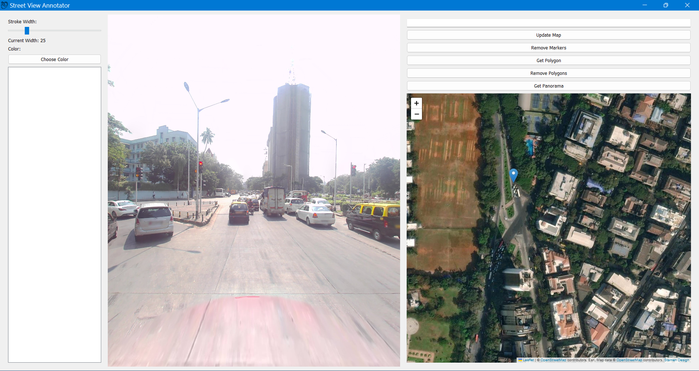

# Annotator

## Table of Contents
- [Installation and Run](#installation-and-run)
- [Tutorial](#tutorial)
- [App Overview](#app-overview)
  - [Side Bar](#side-bar)
  - [Street View Display](#street-view-display)
  - [Right Side Buttons](#right-side-buttons)
  - [Aerial View Map](#aerial-view-map)
  - [To-do/ Issues/ bugs](#Issues)

## Installation and Run

```bash
# Open a terminal and clone the repository
git clone https://github.com/Frozensun47/Street-View-Annotator.git
# Change directory to the cloned repository
cd Street-View-Annotator

# If you have Conda installed, create and activate the environment
# If you don't want to use Conda, skip these two lines
conda create --name annotator python=3.10.10
conda activate annotator

# Install dependencies from requirements.txt
pip install -r requirements.txt

# To Run the annotator
python -m gui
```
## Tutorial


After opening the app, follow these steps:

1. Go to the aerial view map(on the right) and navigate to desired location.
2. Left-click to drop a marker on the  specific location.
3. Click the "Get Panorama Image" button to load the corresponding street view panorama.
    (the street view display should now be changed with new panorma)
4. In the street view display(on the left), left-click to enter, move the mouse to navigate, and right-click to drop markers(in the street view display).
5. After dropping markers, click the "Get Polygon" button to show polygons on the map.


# App Overview and functions

The app consists of three main components:

## Side Bar
On the left, there is a side bar containing stroke width and color selection tools, and a display area for visualizing and editing the coordinates(lat-long) of points being plotted.

## Street View Display


In the middle, there is the street view display with functionalities:

- **Navigate:** Left-click (and keep pressing) inside the street view display area and move the mouse.Scroll up and down to set the FOV.
- **Add Markers:** Right-click to add markers.

## Side Buttons
On the top right side, there are various buttons:

- **Text Input Box:** Paste latitude and longitude for quick marker placement.
- **Update Map:** Press to update the map with the entered coordinates.(To be pressed after Text Input Box input is provided)
- **Remove Marker:** Removes all markers on the map.
- **Get Polygon:** Draws polygons on the aerial view map corresponding to markers in the street view map.(more than 3 markers in the street view is required)
- **Remove Polygon:** Removes all drawn polygons on the map.
- **Get Panorama Image:** Fetches the panorama of the last placed marker on the map and shows it to the street view display.

## Aerial View Map
Functionalities:

- Left-click and drag to move/navigate the map.
- Scroll to zoom in and out.
- Left-click to place a marker.
- Double-click a marker to remove it.
- Click once on a marker to get its latitude and longitude.
- Use + and - symbols to zoom in and out.

## Issues
### Sidebar
  - Make it hide/unhide.
  - Bugs while editing the coordinates in Display.
  - Add number as a text input for stting the size of marker.
  - Add colour for the polygon segmentation for aerial/street view.

### Street-View
  - Add polygon segmentation from the markers.(currently only markers are drawn , polygon segmentation map is also required)
  - add the code to save the current view image, panorma image , with whole segmentation.
  - handle deletion of markers and polygons.(make a undo button)
  - Check calculation of distance from depth.(from experiments)
  - Check directions and heading correctness.(from experiments)
  - Make the update of texture fast.

### Aerial-View
  - Add tool to draw on aerial view , and update that to the street view.
  - Update the marker position with the actual panorma image position.
  - Adding marker from text input does not fetches the panorma image. (Bug)
  - Make it posible to delete individual polygon aread.

